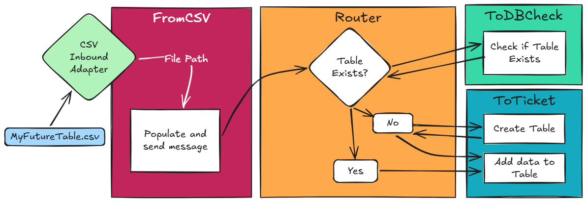

## CSVGen PyProd

Today I published CSVGen Pyprod, a simple implementation of an [Example of PyProd Idea](
https://ideas.intersystems.com/ideas/DPI-I-955) for the [Community Bounty Program](https://community.intersystems.com/post/community-bounty-program-idea-application-%E2%80%94-round-1-live)

The basic premise is a production that either creates or adds to tables from CSV files added to a certain directory. It basically creates a production that does the same thing as the popular OpenExchange package [csvgen](https://openexchange.intersystems.com/package/csvgen). This production consists of four business hosts and an inbound adapter, arranged something like this: 




The CSV Inbound Adapter polls a directory (IN) for new `.csv` files, and when it finds one, moves it to the WORKING directory and sends the file path to its Business Host: the `FromCSV` Business Service. This BS then checks the headers of the File, and passes on the headers, combined with the file name to the `Router` Business Process. 

The logic behind the router is simple, first it sends a message to `ToCheckDB` which searches the database to see if the table already exists. If it doesn't there is a call to `ToDB` to create a table, using the `DBCreateRequest` message class. Finally, there is a call to `ToDB` with the `DBUpdateRequest` to add the data to the selected table. 

## Walkthrough 

All of this was built in [InterSystems PyProd](https://github.com/intersystems/pyprod), a great Python library for building IRIS productions Pythonically. The whole library should feel pretty familiar to experienced IRIS users, while being consistently Pythonic in naming and design. As someone who has much more experience coding in Python than ObjectScript, PyProd really appeals to me. 

Below I am going to go through some of the key steps in defining this production, beware though! For the sake of article brevity, I'm only showing some key steps. If you need more, you'll have to look directly at the code! 

Starting basic, lets install pyprod: 

```bash
pip install intersystems_pyprod --target /usr/irissys/mgr/python
```


PyProd's syntax is super easy. For each component, you just need to inherit from the relevant superclass and define the functions that the component needs. 

For the message class this varies between JsonSerialize-able (character-based) and PickleSerilize-able (Python or binary objects). Otherwise its super easy to create a message class:


```python
from intersystems_pyprod import BusinessService, BusinessProcess, BusinessOperation, InboundAdapter, JsonSerialize

# Defines the IRIS package name for all components in this file 
iris_package_name = "CSVGenPyProd"

class FileMessage(JsonSerialize):
    file_path:str = Column()
    headers:list = Column()
    schema:str = Column()

```

To create an Inbound Adapter class, you just need to define a `on_task` function, which passes the data up to the BS with `self.business_host_process_input`:

```python
class CSVReaderAdapter(InboundAdapter):
    inbound_file_dir: str = IRISProperty(description="Directory to monitor for new CSV files", settings="Adapter Settings" )
    
    working_file_dir: str = IRISProperty(description="Directory where files in progress are stored ", settings="Adapter Settings")

    def on_task(self):
        ###
        ### ...Polling Logic
        ###
        self.business_host_process_input(filepath)
        return Status.OK()
```

This passes the data (in this case a file path) up to the host business service's `on_process_input` function: 

```python
class FromCSV(BusinessService):
    
    # Inbound adapter 
    ADAPTER:str = IRISParameter(value="CsvgenPyprod.CSVInboundAdapter", description="CSV Watcher inbound adapter")
    
    # Configurable target setting
    process_target:str = IRISProperty(description="Business process to send message to", settings="Target Settings")

    def on_process_input(self, input):
        ##
        ##  More filehandling logic
        ##
        request_message = FileMessage(filepath, headers)
        status = self.send_request_async(self.process_target, request_message)
        return Status.OK()
```

The business process receives the request through the `on_request()` function, and then itself sends multiple requests, some of which are synchronous, some are asynchronous: 

```python
class Router(BusinessProcess):
    
    # Configurable settings
    db_check_target = IRISProperty(description="Operation to check the database", settings="Target Settings")
    to_db_target = IRISProperty(description="Operation to add to the database", settings="Target Settings")

    default_schema = IRISProperty(description="Default schema to save files to", settings="TargetSettings")

    def on_request(self, input):
        ## message logic
        status, response = self.send_request_sync(self.db_check_target, FileMessage(...))
        ## if... then...
        
        #create table 
        status, response = self.send_request_sync(self.to_db_target, DBCreateRequest(...))

        # Add to table: 
        status, response = self.send_request_async(self.to_db_target, DBUpdateRequest(...), response_required=0)
        return Status.OK()
```

Finally, we have the Business Operations. I'm only going to show the `ToDB` one (and again, a pretty truncated view of this), but it should give you a clue. The `message_map` property is a dictionary which defines the functions which should be activated based on the type of message which arrives. You may have noticed in the `Router` above, we send the same operation two different message types, these activate different functions: 

```python
class ToDB(BusinessOperation):

    message_map = {
        f"{iris_package_name}.DBCreateRequest":"create_table",
        f"{iris_package_name}.DBUpdateRequest":"add_to_table"
    }

    def create_table(self, input):

        # Sample 50 rows to infer column types without reading the full file
        df = pd.read_csv(input.file_path, nrows=50)
 
        #... Work out column types ...
        
        stmt = iris.sql.prepare("CREATE TABLE ...")
        stmt.execute()

    def add_to_table(self, input):

        stmt = iris.sql.prepare(f"INSERT INTO {input.schema}.{table_name} ({columns}) VALUES ({placeholders})")
        # Handle big data... 
        for chunk in pd.read_csv(input.file_path, chunksize=100000):
            ## Row/Value handling... 
            stmt.execute(...)
```


### Defining the Production

The last thing I haven't mentioned it isn't just the components that are defined in Python, its also the production itself. I'm only going to show the service, here but the other components are defined in exactly the same way:

```python
from intersystems_pyprod import Production, ServiceItem, ProcessItem, OperationItem 

class Prod(Production):

    services = [
        ServiceItem("FromCSV", # Component Name 
                    "CsvgenPyprod.FromCSV", #IRIS Class Name
                    host_settings={"process_target":"Router"}
                    adapter_settings={
                        "inbound_file_dir":"/home/irisowner/dev",
                        "working_file_dir":"/home/irisowner/dev"
                                    })
    ]
    #processes = [...]
```

Its important to note that if you do define the production in Python, **the changes you make from the UI are not reflected in the code**. Its a good idea to stick to either using the UI or code, but not mixing them, because any settings changes from the UI will be overwritten next time you register the production from PyProd. 


## Loading the components 

Our components and production still need to be registered into IRIS. This is done with the `intersystems_pyprod` cli. Note this is installed at `/usr/irissys/mgr/python/bin` (assuming you used the command I gave above), so make sure this is on your PATH.

```bash
intersystems_pyprod components.py 
intersystems_pyprod production.py
```

## Conclusion
And that's basically it! I skipped over quite a lot of the code, but it is all available to look at and run yourself. 

I will finish by mentioning a few tips that helped me: 

- If you get `Not Implemented` errors after a `send_request_async()` response in the business process, try setting `response_required=0` as a parameter to the call.
    - *By default, an async call from a BP requires a response, and this response is piped to the `on_response` function. You can either implement this function, or set `response_required=0`*

- You can use built-in adapters, like `EnsLib.File.InboundAdapter`, just watch out as its hard to use these in a Pythonic way. Changing between IRIS Objects and Python objects can be a bit awkward, so I opted to stick to fully Python. Unless you already have a deep knowledge of ObjectScript, I'd recommend doing the same. 

- Use `IRISLog.Error` and `IRISLog.Info`! 
- If you change the code, the production needs to restart before the changes take effect. I created args-based wrapper around the `intersystems_pyprod.director` module, so I could run:

```bash
python3 controls.py restart
``` 

- The `components.py` file doesn't need to be reloaded if you change the internal methods, but do need to be reloaded for the scaffolding steps (e.g. changes to the `message_map` or creating new components). I normally reload them anyway because it takes seconds. The production class needs to be reload for any change.  


I hope this article and example helps you get started with your own PyProd projects! 

